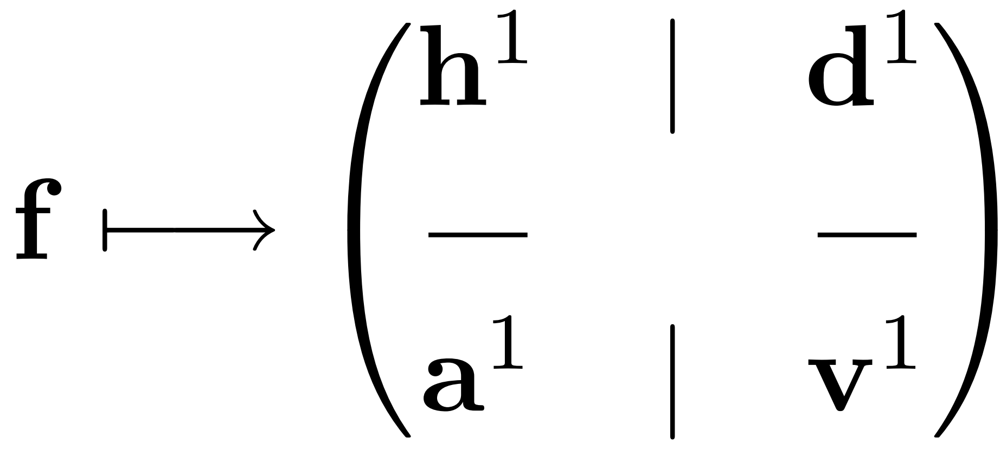

# Transform of the tensor products of the 1D scaling signal and the 1D wavelet

## Описание
Вычислены тензорные произведения масштабирующих векторов и вейвлет-векторов в их различных комбинациях. Результаты построены в виде 2D-картинок.

Рассмотрены вейвлет преобразования тензорных произведений. Подтвержден факт - результатом вейвлет преобразования является матрица, состоящая из нулей, за исключением одного элемента - один элемент равен единице.

Координаты  единичного элемента однозначно определяются:
1. Составом векторов в комбинации (${V_m \otimes V_n}$, ${V_m \otimes W_n}$, ${W_m \otimes V_n}$ или ${W_m \otimes W_n}$).
2. Номерами m,n векторов согласно таблице ниже:

|         | **m=1**  | **m=2**  |
|---------|----------|----------|
| **n=2** | m=1, n=2 | m=2, n=2 |
| **n=1** | m=1, n=1 | m=2, n=1 |

В качестве базовой принята схема преобразований из книги [1].

Эта схема отличается от реализованной в [PyWavelets](https://pywavelets.readthedocs.io/en/latest/)

## Перечень основных файлов
- [pixel.ipynb](pixel.ipynb) - основной блокнот с результатами исследований.
- [tensors.py](tensors.py) - скрипт построение графиков, соответствующих Figure 4.2 упражнения 4.1.C из [1].
- [pixel_pywt.py](pixel_pywt.py) - дополнительный скрипт с реализацией упражнения 4.1.C. из [1] с использованием [PyWavelets](https://pywavelets.readthedocs.io/en/latest/)

## Пользовательские функции
- [split_matrices.py](/Functions/split_matrices.py)
- [combine_matrices.py](/Functions/combine_matrices.py)
- [mtrxHaar.py](/Functions/mtrxHaar.py)
- [vwHaar.py](/Functions/vwHaar.py)

## Примечания
1. Отличия схем преобразования

### Схема преобразований в [1]

### Схема преобразований в 

2. Результат упражнения 4.1.C из [1] все равно не совпадает с картинкой в части отступов по краям. Вероятно, в [1] вставлен вырезанный фрагмент полной картинки.

## Reference
1. James S. Walker. A Primer on Wavelets and Their Scientific Applications. 2nd Edition. 2008.
2. [2D Forward and Inverse Discrete Wavelet Transform](https://pywavelets.readthedocs.io/en/latest/ref/2d-dwt-and-idwt.html)